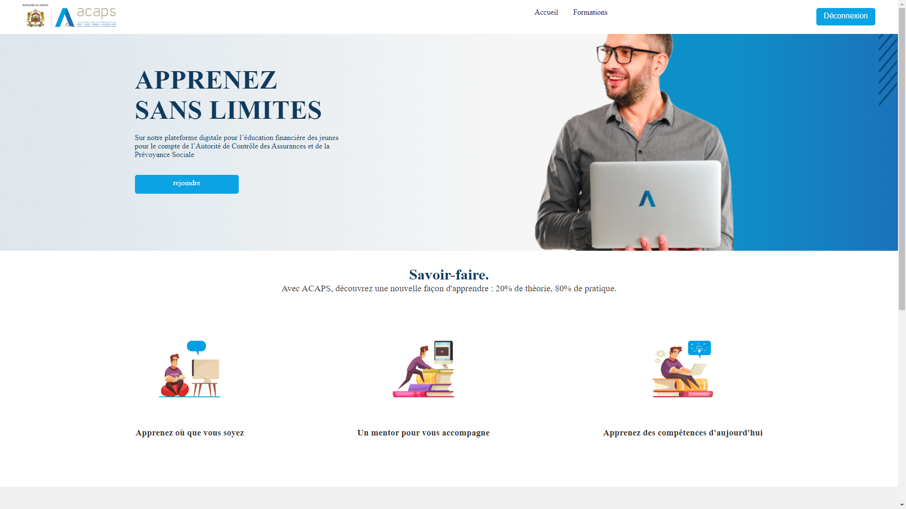

<a id="readme-top"></a>

<!-- PROJECT LOGO -->
<br />
<div align="center">
 

  <h3 align="center">AutoForm</h3>

  <p align="center">
    An innovative training platform dedicated to students and professionals, providing a secure and user-friendly environment for personal and professional growth.
  </p>
</div>

<!-- TABLE OF CONTENTS -->
<details>
  <summary>Table of Contents</summary>
  <ol>
    <li>
      <a href="#about-the-project">About The Project</a>
      <ul>
        <li><a href="#built-with">Built With</a></li>
      </ul>
    </li>
    <li><a href="#screenshots">Screenshots</a></li>
    <li>
      <a href="#getting-started">Getting Started</a>
      <ul>
        <li><a href="#prerequisites">Prerequisites</a></li>
        <li><a href="#installation">Installation</a></li>
      </ul>
    </li>
    <li><a href="#contact">Contact</a></li>
  </ol>
</details>

<!-- ABOUT THE PROJECT -->
## About The Project

<a href="https://github.com/Hamza-Alali-0/AutoForm">
    
</a>

AutoForm is an innovative training platform designed to revolutionize education by providing a user-friendly and secure environment for students and professionals. The platform simplifies access to high-quality courses and resources, fostering an engaging and collaborative learning experience.

Here's why AutoForm stands out:
- **Comprehensive Learning Platform**: Offers a wide range of meticulously documented and regularly updated courses.
- **User-Friendly Interface**: Simplifies access to training and development resources.
- **Tailored Dashboard**: Enables users to efficiently track and manage their progress.
- **Secure Registration System**: Allows users to quickly create accounts and access the full collection of courses.

AutoForm aims to empower learners by providing a platform that aligns with their personal and professional goals, ensuring an effective and enriching educational journey.

### Built With

This project is built with the following technologies:

* [![Python][Python.com]][Python-url]
* [![Django][Django.com]][Django-url]
* [![MySQL][MySQL.com]][MySQL-url]
* [![HTML][HTML.com]][HTML-url]
* [![CSS][CSS.com]][CSS-url]

<!-- Reference-style links for images -->
[Python.com]: https://img.shields.io/badge/Python-3776AB?style=for-the-badge&logo=python&logoColor=white
[Python-url]: https://www.python.org/
[Django.com]: https://img.shields.io/badge/Django-092E20?style=for-the-badge&logo=django&logoColor=white
[Django-url]: https://www.djangoproject.com/
[MySQL.com]: https://img.shields.io/badge/MySQL-4479A1?style=for-the-badge&logo=mysql&logoColor=white
[MySQL-url]: https://www.mysql.com/
[HTML.com]: https://img.shields.io/badge/HTML-E34F26?style=for-the-badge&logo=html5&logoColor=white
[HTML-url]: https://developer.mozilla.org/en-US/docs/Web/HTML
[CSS.com]: https://img.shields.io/badge/CSS-1572B6?style=for-the-badge&logo=css3&logoColor=white
[CSS-url]: https://developer.mozilla.org/en-US/docs/Web/CSS

<p align="right">(<a href="#readme-top">back to top</a>)</p>

<!-- SCREENSHOTS -->
## Screenshots

Here are some screenshots of the project:

| ![Login Page][login-screenshot] | ![Home Page][home-screenshot] | ![Courses Page][courses-screenshot] |
|---------------------------------|-------------------------------|--------------------------------------|
| **Login Page**                  | **Home Page**                 | **Courses Page**                     |

<!-- Reference-style links for images -->
[login-screenshot]: Assets/connexion.png
[home-screenshot]: Assets/inscription.png
[courses-screenshot]: Assets/formations.png

<p align="right">(<a href="#readme-top">back to top</a>)</p>

<!-- GETTING STARTED -->
## Getting Started

To get a local copy up and running, follow these simple steps.

### Prerequisites

Before you begin, ensure you have the following installed:
- [Python](https://www.python.org/downloads/) (version 3.8 or higher)
- [Django](https://www.djangoproject.com/download/)
- [XAMPP](https://www.apachefriends.org/index.html) (includes MySQL and Apache)

### Installation

1. **Clone the repository**:
   ```sh
   git clone https://github.com/Hamza-Alali-0/AutoForm.git
   
2. **Import Database**:
   
   Import the pfepython.sql file into the XAMPP (mysql) databases.


3. **Install Requirements**:
   ```sh
   pip install -r requirements.txt

4. **Run Migrations**:
    ```sh
    python manage.py migrate
  

5. **Run the Server**:
    ```sh
    python manage.py runserver


<a id="contact"></a>
## Contact

Hamza Alali - [hamza.alali.dev@gmail.com](mailto:hamza.alali.dev@gmail.com)


Connect with me:
- <a href="https://dev.to/@hamzaalali0" target="_blank"></a>
- <a href="https://www.linkedin.com/in/hamza--alali" target="_blank"></a>
- <a href="https://github.com/hamza-alali-0" target="_blank"></a>
- <a href="https://www.instagram.com/alalihamza.0/" target="_blank"></a>

Project Link: [https://github.com/Hamza-Alali-0/Autoform](https://github.com/Hamza-Alali-0/Autoform)

<p align="right">(<a href="#readme-top">back to top</a>)</p>
   

